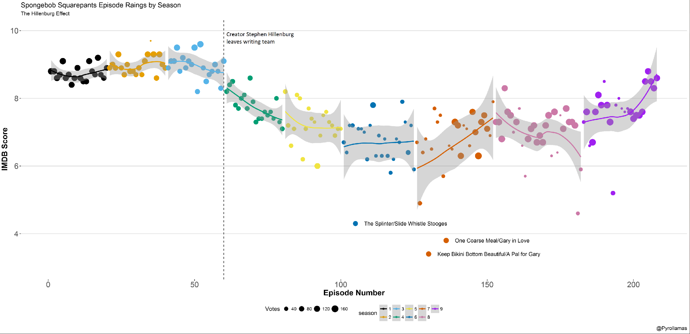
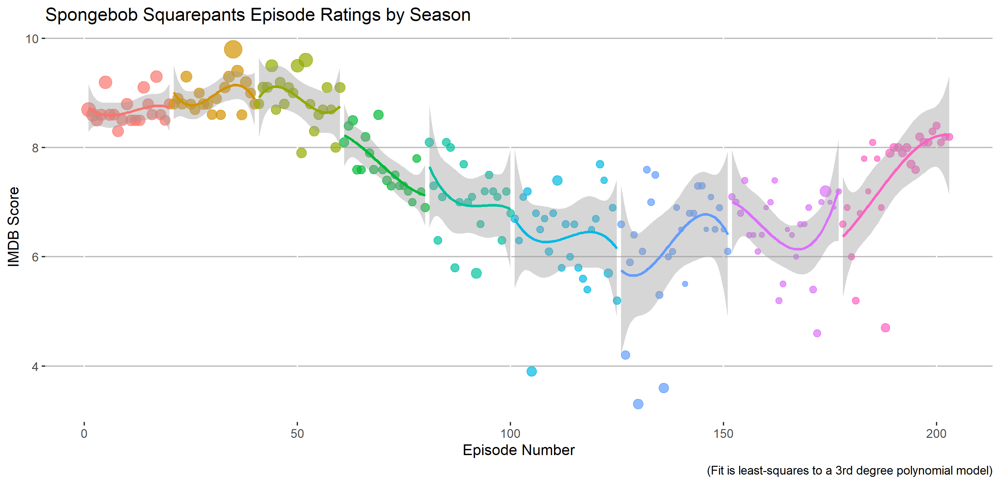

```{r setup, include=FALSE}
options(htmltools.dir.version = FALSE)
library(data.table)
library(ggplot2)
library(hrbrthemes)
library(broom)

data_dt <- as.data.table(readRDS("D:/Economics/Projects/microeconometrics/data/raw/spongebob_ratings_szn1-9_8_2020.rds"))

rdd_function <- function(threshhold, bandwidth, dat){
  input_data <- as.data.table(dat)
  func_dt <- input_data[, `:=`(treat=ifelse( episode_nr > threshhold , 1 , 0 ) ,
                               x = (episode_nr-threshhold))]
  
  regression_discontinuity_df <- func_dt[ episode_nr >= threshhold - bandwidth &
                                            episode_nr <= threshhold + bandwidth ,
  ]
  ols <- lm( data = regression_discontinuity_df , 
             formula = rating ~ treat*x  )
  wls <- lm( data = regression_discontinuity_df , 
             formula = rating ~ treat*x ,
             weights = votes )
  
  ols_output <- cbind( as.data.table(tidy(ols, conf.int = T)) , 
                       band = rep(bandwidth , 
                                  nrow(as.data.table(tidy(ols)))) , 
                       thresh = rep(threshhold , 
                                    nrow(as.data.table(tidy(ols)))) , 
                       model = rep("ols" , 
                                   nrow(as.data.table(tidy(ols)))) 
  )
  wls_output <- cbind( as.data.table(tidy(wls, conf.int = T)) , 
                       band = rep(bandwidth , 
                                  nrow(as.data.table(tidy(wls)))) , 
                       thresh = rep(threshhold , 
                                    nrow(as.data.table(tidy(wls)))), 
                       model = rep("wls" , 
                                   nrow(as.data.table(tidy(wls)))) 
  )
  output <- rbind(ols_output , wls_output)
  
  return(output)
}

thresh_vary_bw_func <- function(indx){
  thresh_func_output <- list()
  thresh_vary_band_i <- sapply( indx:(nrow(data_dt)-indx) , rdd_function, bandwidth = indx , dat = data_dt )
  for(i in 1:ncol(thresh_vary_band_i)){
    thresh_func_output[[i]] <- thresh_vary_band_i[,i]
  }
  return(rbindlist(thresh_func_output))
}


```

# Background

- The "Hillenburg Effect" is a term that has been employed at least since Reddit user `@Pyrollamas` posted a graph of *Spongebob Squarepants* ratings, and described the seeming-decline of the show's ratings around episode 60 (when creator Stephen Hillenburg left the show).

--

.center[

]

---
# The 'Hillenburg Effect': Today

- Image was posted 2 years ago; ratings and vote counts have changed somewhat since.

.center[

]

--

- Some differences, but trends seem to remain today.

---
# Research question

- **Does the Hillenburg Effect exist?**

--

- Need to know: What is the 'Hillenburg Effect' specifically?

--

  - I will operate under the definition of the Hillenburg Effect as: a hypothesized change in either the *level of ratings*, the *trend in ratings*, or both, following the departure of Stephen Hillenburg from the writing staff *after* the 60th episode.
  
---
# "Bin scatter" of Ratings

- Removing some of the noise from the original data:

```{r binscatter, echo=F, warning=F, dpi=300, fig.align='center' , fig.width=7, fig.height=4}

rdddt <- data_dt[, `:=`(treat=ifelse( episode_nr > 60 , 1 , 0 ),
                        group=cut(episode_nr , breaks = seq(0,204,5) ))
]
bin_scatter_dt <- cbind(group_nr = 1:length(unique(rdddt$group)) , rdddt[ , .(rating = mean(rating)), by=group ])

binscatter_plot <- 
  ggplot( data = bin_scatter_dt ) + 
  geom_point( aes(x = group_nr , y = rating), size = 1.5 ) + 
  geom_vline( aes(xintercept = 12) , linetype = 2 , size = 1, color = "#F8766D", alpha=0.7) + 
  labs(title = "Average Episode Rating" , 
       subtitle = "Averaged into 5-episode bins" , 
       y = "Avg. Rating" , 
       x = "Episode bin") +
  theme_ipsum_rc( plot_title_size = 11 , 
                  subtitle_size = 10,
                  base_size = 8 , 
                  caption_size = 9,
                  axis_title_size = 9)+
  theme( legend.position = 'none')

binscatter_plot
```

---
class: inverse, center, middle

# Methodology
---

# Data

- The data used to estimate the effect are the same IMDB ratings as the original graphic, scraped from the source in the same way.

--
  - Focus on the same episodes: a sequence of ratings and votes for Episodes 1 through 203, the first nine seasons.
  - Variable of interest is ratings.
--
- Given this kind of data, there are multiple types of models we could use to estimate the Hillenburg Effect.

---
# Methodology

- *Filtering estimates:* Pros of filtering estimates are that they can recover statistics about a trace (like the state/expected value and variance) at every point. 
    - Cons of filtering estimates are that "change in trend" means something different (change in the stable/non-white noise trace component that the filter estimates) and depending on the underlying state-space model, it's difficult to infer what a "change in slope" would mean.
--

- *Regression estimates:* Regression estimates include any linear model like a basic or multivariate least-squares estimates or ANOVA. Pros of regression estimates are that (at least under any similar assumptions in other methods e.g. filtering) inference is straightforward thanks to formulas for estimate variance. Cons are, similar to filtering estimates, dependence on the validity of the regression model. 
---
# Discontinuity estimator

- The estimation methods described are not actually so different. Both depend on the validity of underlying linear models. Because of their similarity, it is possible to take the "best of both worlds."
- The [Regression Discontinuity](https://www.princeton.edu/~davidlee/wp/RDDEconomics.pdf) estimator is often used to try and estimate causal effect sizes from threshhold discontinuities (i.e. [estimating the causal impact of arrest on future crime by using the 0.08 BAC discontinuity](https://www.aeaweb.org/articles?id=10.1257/aer.20130189) for arrest).
--

  - The way we can apply it here is very similar to the [structural break tests](https://en.wikipedia.org/wiki/Structural_break) tests that would be used with filtering estimates, though, and have similar interpretation.
  - **Interpretation:** We are using methods very similar to regression discontinuity to try and estimate whether or not it's likely that there was a sudden "break" in the pattern of episode ratings after the 60th episode.
--

- Specifically, I will use *local linear estimation with a rectangular kernel*.

---
# What it is

It's just the following equation:

$$R_i = \beta_0 + \beta_1 \cdot x_i +  \beta_2 \cdot D_i + \beta_3 \cdot (D_i x_i) + \varepsilon_i $$

--

- $R_i$ is the rating of episode $i$; $D_i = \{0 \ \text{if} \ i \leq c \ ,\ 1 \ \text{if} \ i > c\}$; and $x_i \equiv (i-c)$. 

--

- Our "jump" estimate is the estimate of $\beta_2$, $\hat{\beta_2}$. It will tell us how much lower (if at all) the ratings started-off after Hillenburg left.
- Our trend estimate is the estimate of $\beta_3$, $\hat{\beta_3}$. It will tell us how much (if at all) the ratings trend declined as the episodes went-on after Hillenburg's departure.

--

- Basically: We fit 2 lines to the data, one on either side of $c=60$. We compare the difference between the lines as $i$ approaches $c$. This difference is $\beta_2$, but is measured (possibly with bias, and/or error) as $\hat{\beta_2}$.

---
# Effect identification problem

- We can't be sure whether $\text{cov}(x_i,\varepsilon_i) \neq 0$, and so we can't rule-out hypotheses like Hillenburg leaving *because* the writing quality in the show was declining (which would presumably be reflected by a realization of $c$ after the background quality picked-up in $\varepsilon_i$ was declining). 

--

  - If Hillenburg had-- for example-- suddenly and unexpectedly quit right after the 60th episode due to some unforseen events or circumstances (major health accidents, for instance), then we could be more convinced that this wasn't the case, and could expect any decline in ratings to reflect genuine quality differences. Then, it would inch slightly closer to the statistical conditions of a randomized experiment.

--

- We've talked about what we *can't* do, now we'll see what we *can* estimate.
---
# Steps to discontinuity estimation

- The estimation procedure (in English) based on [Lee and Lemieux(2010)](https://www.princeton.edu/~davidlee/wp/RDDEconomics.pdf) (JEL) is to:
--

  1. Pick a bandwidth $bw$ around the threshhold $c=60$, i.e. $c \pm bw$.
  
  2. Pick a model $f(x_i,c)$, usually among set of polynomials in $x_i$.
  
  3. Trim the data to all $i \in [ c - bw , c + bw]$.
  
  4. Estimate $R_i = f(x_i,c)$ using OLS or WLS. 
  
  5. Cross-validate by repeating steps 1-4 for $bw \in \left[\overline{bw}_{min}, \text{median}(\text{min}\{c,(N-c)\}) \right]$
  - In our case, $bw \in \left[\overline{bw}_{min}, \frac{1}{2}c \right]$. I pick $\overline{bw}_{min} = 5$.
  
---
# Example bandwidth selection: Small

```{r bw-example-small, echo=F, message=F, dpi=300, fig.align='center' , fig.width=5, fig.height=4, out.height='80%', out.width='80%'}
ggplot( data_dt[ episode_nr >= 50 &
                   episode_nr <= 70 , ][,treat:=ifelse(episode_nr>60,1,0)] ,
        aes( x = episode_nr , 
             y = rating , 
             color = as.factor(treat))) +
  geom_point( alpha = 0.7 ) + 
  geom_smooth(method = 'lm', se = F) +
  geom_vline( xintercept = 60 ,
              linetype = 2) + 
  labs( x = "Episode Number" , 
        y = "IMDB Score" ,
        title = "Spongebob Episode Ratings" , 
        subtitle = "Bandwidth of 10",
        caption = "(Dashed line at Episode 60; the last with S. Hillenburg as writer)") +
  theme_ipsum_rc( plot_title_size = 10 , 
                  subtitle_size = 8,
                  base_size = 6 , 
                  caption_size = 7,
                  axis_title_size = 7)+
  theme( legend.position = 'none')
```

---
# Example bandwidth selection: Large

```{r bw-example-big, echo=F, message=F, dpi=300, fig.align='center' , fig.width=5, fig.height=4, out.height='80%', out.width='80%'}

ggplot( data_dt[ episode_nr >= 30 &
                   episode_nr <= 90 , ][,treat:=ifelse(episode_nr>60,1,0)] ,
        aes( x = episode_nr , 
             y = rating , 
             color = as.factor(treat))) +
  geom_point( alpha = 0.7 ) + 
  geom_smooth(method = 'lm', se = F ) +
  geom_vline( xintercept = 60 ,
              linetype = 2) + 
  labs( x = "Episode Number" , 
        y = "IMDB Score" ,
        title = "Spongebob Episode Ratings" , 
        subtitle = "Bandwidth of 30 (max)",
        caption = "(Dashed line at Episode 60; the last with S. Hillenburg as writer)") +
  theme_ipsum_rc( plot_title_size = 10 , 
                  subtitle_size = 8,
                  base_size = 6 , 
                  caption_size = 7,
                  axis_title_size = 7)+
  theme( legend.position = 'none' )
```

---
# Jump estimates across bandwidths

```{r bandwidths-jump, echo=F, message=F, dpi=300, fig.align='center' , fig.width=5, fig.height=4, out.height='80%', out.width='80%'}


bw_vary <-  sapply( seq(5,30,1) , rdd_function, threshhold = 60 , dat = data_dt )
bw_outputs <- list()
for(i in 1:ncol(bw_vary)){
  bw_outputs[[i]] <- bw_vary[,i]
}
bw_dt <- rbindlist(bw_outputs)

# ordinary least squares
ols_discontinuity_coefs <- bw_dt[model=="ols"& term=="treat", .(estimate, conf.low, conf.high,band)]

ggplot(ols_discontinuity_coefs) + 
  geom_line(aes(x = band , 
                y = estimate) , 
            size = 1) + 
  geom_line(aes(x = band , 
                y = conf.low),
            linetype = 2 , 
            size = 1 ) + 
  geom_line(aes(x = band , 
                y = conf.high),
            linetype = 2 , 
            size = 1 ) +
  geom_hline( aes(yintercept = 0 ) , color = '#00BFC4' , size = 1) +
  labs( title = "Hillenburg 'Jump' Effect: OLS Estimates" , 
        subtitle = "by Bandwidth Around 60th Episode" , 
        y = "Estimate" , 
        x = "Bandwidth" , 
        caption = "(Bandwidth measured in number of episodes.)") +
  theme_ipsum_rc( plot_title_size = 10 , 
                  subtitle_size = 8,
                  base_size = 6 , 
                  caption_size = 7,
                  axis_title_size = 7)+
  theme( legend.position = 'none' )

```

---
# Trend estimates across bandwidths

```{r bandwidths-trend, echo=F, message=F, dpi=300, fig.align='center' , fig.width=5, fig.height=4, out.height='80%', out.width='80%'}

ols_trend_coefs <- bw_dt[model=="ols"&term=="treat:x" , .(estimate, conf.low, conf.high,band)]
ggplot(ols_trend_coefs) + 
  geom_line(aes(x = band , 
                y = estimate) , 
            size = 1) + 
  geom_line(aes(x = band , 
                y = conf.low),
            linetype = 2 , 
            size = 1 ) + 
  geom_line(aes(x = band , 
                y = conf.high),
            linetype = 2 , 
            size = 1 ) +
  geom_hline( aes(yintercept = 0 ) , color = '#00BFC4' , size = 1) +
  labs( title = "Hillenburg Trend Effect: OLS Estimates" , 
        subtitle = "by Bandwidth Around 60th Episode" , 
        y = "Estimate" , 
        x = "Bandwidth" , 
        caption = "(Bandwidth measured in number of episodes.)") +
  theme_ipsum_rc( plot_title_size = 10 , 
                  subtitle_size = 8,
                  base_size = 6 , 
                  caption_size = 7,
                  axis_title_size = 7)+
  theme( legend.position = 'none' )
        
```

---
# Sampling inference

There seems to be statistically insignificant negative variation occurring at the 60th Spongebob episode.

- Ratings may have been slightly (0.5 stars) lower at the start of the fourth season.
- No clear *start* of a decline specifically at the start of the fourth season. 

--

- *Interpretation*: Based on a general $t$ sampling distribution it would be unlikely that there was a significant 'structural break' in the ratings trends when Hillenburg departed. Estimates of the break fall inside of the 95\% confidence interval for almost all choices of bandwidth, using the linear model. 

---
# Empirical p-value inference

The problem is that, based on the first figures, the distribution of episode ratings varies as the series progresses. 

- For this reason, the valid form of inference is to "assign" Hillenburg quitting the show to every possible episode and estimating that "placebo" effect. 

- If the "true" effect (i.e. the effect measured at the 60th episode) ranks highly relative to the distribution of placebo treatments, we may infer that Hillenburg's quit was associated with a significant change in ratings.

---
# Empirical p-value inference: Jump effect

```{r jump-ri, echo=F, message=F, dpi=300, fig.align='center' , fig.width=5, fig.height=4, out.height='85%', out.width='85%'}

thresh_dt <- rbindlist(lapply(seq(10,30,10), thresh_vary_bw_func))

thresh_vary_ols_treat_coefs <- thresh_dt[model=="ols"&term=="treat", 
                                         .(estimate, conf.low, conf.high,statistic,thresh,band)
][
  , true_disc := ifelse(thresh==60,1,0)
]

ggplot(thresh_vary_ols_treat_coefs) + 
  facet_wrap( ~band , 
              nrow = 3) + 
  geom_histogram( aes(x = estimate) ,
                  fill = "#00BFC4" ,
                  color = 'black' ,
                  binwidth = 0.1) + 
  geom_vline(xintercept = 0 , color = 'black' , size = 1) + 
  geom_vline( data = thresh_vary_ols_treat_coefs[band==10,] , 
              aes(xintercept = -0.3912) ,
              color = '#F8766D' , 
              size = 1) + 
  geom_vline( data = thresh_vary_ols_treat_coefs[band==20,] , 
              aes(xintercept = -0.3595) ,
              color = '#F8766D' , 
              size = 1) + 
  geom_vline( data = thresh_vary_ols_treat_coefs[band==30,] , 
              aes(xintercept = -0.636337) ,
              color = '#F8766D' , 
              size = 1) + 
  labs( title = "Placebo Quit: OLS 'Jump' Estimates" , 
        subtitle = "by Bandwidth (in number of eps.) around 'quit' episode" , 
        caption = "(Red dashed line representing the estimate of the 60th episode)" , 
        x = "Estimate" , 
        y = "Count")  +
  theme_ipsum_rc( plot_title_size = 10 , 
                  subtitle_size = 8,
                  base_size = 6 , 
                  caption_size = 7,
                  axis_title_size = 7, 
                  strip_text_size = 6)+
  theme( legend.position = 'none' , 
         panel.grid = element_line(color='white'))
```

---
# Empirical p-value inference: Trend effect


```{r trend-ri, echo=F, message=F, dpi=300, fig.align='center' , fig.width=5, fig.height=4, out.height='85%', out.width='85%'}
thresh_vary_ols_trend_coefs <- thresh_dt[model=="ols"&term=="treat:x", 
                                         .(estimate, conf.low,statistic, conf.high,thresh,band)
][, true_disc := ifelse(thresh==60,1,0)
]


ggplot(thresh_vary_ols_trend_coefs) + 
  facet_wrap( ~band ,
              nrow = 3 ) + 
  geom_histogram( aes(x = estimate) , 
                  fill = "#00BFC4" ,
                  color = 'black' ,
                  binwidth = 0.01) + 
  geom_vline(xintercept = 0 , color = 'black' , size = 1) + 
  geom_vline( data = thresh_vary_ols_trend_coefs[band==10,] , 
              aes(xintercept = -0.00697) ,
              color = '#F8766D' , 
              size = 1) + 
  geom_vline( data = thresh_vary_ols_trend_coefs[band==20,] , 
              aes(xintercept = -0.04) ,
              color = '#F8766D' , 
              size = 1) + 
  geom_vline( data = thresh_vary_ols_trend_coefs[band==30,] , 
              aes(xintercept = -0.0258) ,
              color = '#F8766D' , 
              size = 1)  + 
  labs( title = "Placebo Quit: OLS Trend Estimates" , 
        subtitle = "by Bandwidth (in number of eps.) around 'quit' episode" , 
        caption = "(Red dashed line representing the estimate of the 60th episode)" , 
        x = "Estimate" , 
        y = "Count")  +
  theme_ipsum_rc( plot_title_size = 10 , 
                  subtitle_size = 8,
                  base_size = 6 , 
                  caption_size = 7,
                  axis_title_size = 7 , 
                  strip_text_size = 6)+
  theme( legend.position = 'none', 
         panel.grid = element_line(color='white'))

```

---
# Empirical p-values

- Discontinuity estimates:

```{r ri-pvalues, echo = F}

thresh_vary_ols_pvalue <- list()
for(i in 1:3){
  indx = i*10
  
  band_i_trn_dt <- 
    thresh_vary_ols_trend_coefs[band==indx , ]
  band_pval_trn_dt <- 
    band_i_trn_dt[,`:=`(rank_est = 1+nrow(band_i_trn_dt)-rank(abs(estimate)),
                        p_est = (1/nrow(band_i_trn_dt))*(1+nrow(band_i_trn_dt)-rank(abs(estimate))) , 
                        rank_t = 1+nrow(band_i_trn_dt)-rank(abs(statistic)) ,
                        p_t = (1/nrow(band_i_trn_dt))*(1+nrow(band_i_trn_dt)-rank(abs(statistic))) , 
                        coef="discontinuity")
    ][
      ,.(rank_est,rank_t,p_est,p_t,band,coef,true_disc)
    ]
  
  band_i_trt_dt <- 
    thresh_vary_ols_treat_coefs[band==indx , ]
  band_pval_trt_dt <- 
    band_i_trt_dt[,`:=`(rank_est = 1+nrow(band_i_trt_dt)-rank(abs(estimate)),
                        p_est = (1/nrow(band_i_trt_dt))*(1+nrow(band_i_trt_dt)-rank(abs(estimate))),
                        rank_t = 1+nrow(band_i_trt_dt)-rank(abs(statistic)) ,
                        p_t = (1/nrow(band_i_trt_dt))*(1+nrow(band_i_trt_dt)-rank(abs(statistic))) ,
                        coef="trend")
    ][
      ,.(rank_est,rank_t,p_est,p_t,band,coef,true_disc)
    ]
  
  thresh_pval_dt <- rbind(band_pval_trn_dt,
                          band_pval_trt_dt)
  
  thresh_vary_ols_pvalue[[i]] <- thresh_pval_dt
}

ols_p_val <- rbindlist(thresh_vary_ols_pvalue)
treatment_p_vals <- ols_p_val[true_disc==1,.(coef,band,p_est,p_t,rank_est,rank_t)]

treatment_p_vals[coef=="discontinuity" ,
                 ][
                   ,.(band, rank_est, p_est)
                 ]
```

- Trend estimates

```{r ri-trend-pvalues, echo=F}
treatment_p_vals[coef=="trend" ,
                 ][
                   ,.(band, rank_est, p_est)
                 ]
```